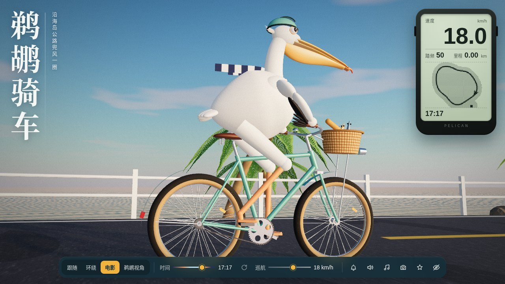

# 鹈鹕骑车

一只戴着薄荷色头盔、围着蓝白条纹围巾的白鹈鹕，骑着城市自行车沿海岛公路兜风。这是一个可交互的 3D 网页，用 three.js 写成，打包成一个离线也能打开的 HTML 文件。



## 在线试玩

打开 <https://duegin.github.io/pelican-bike-3d/> 就能玩，手机也可以。

## 直接打开

也可以下载后双击 `pelican-on-a-bike.html`，用最新版 Chrome、Edge 或 Safari 打开，不需要联网，也不需要安装任何东西。点“出发”后会有声音，右下角可以关掉。

## 怎么玩

| 操作 | 键盘 | 触屏 |
| --- | --- | --- |
| 用力蹬 | 按住 W 或 ↑ | 按住「蹬」 |
| 刹车 | 按住 S 或 ↓ | 按住「刹」 |
| 按车铃 | 空格 | 「铃」 |
| 换镜头（跟随、环绕、电影、鹈鹕视角） | C，或 1 到 4 | 底部按钮 |
| 打招呼（鹈鹕张嘴叫、挥翅膀） | G，或点一下鹈鹕 | 点一下鹈鹕 |
| 调时间 / 日夜循环 | [ 和 ]，T | 底部滑杆 |
| 拍照 / 隐藏界面 / 静音 | P / H / M | 底部按钮 |

## 里面有什么

鹈鹕和自行车全部由代码生成：双腿用两骨 IK 踩着踏板转，翅膀握着车把，链条一节节跟着牙盘走，下坡不蹬时飞轮会“咔哒”滑行，围巾用 Verlet 布条模拟随风飘，喉囊随踩踏晃动。

世界同样是程序生成的：带浅滩和岸边浪花的自定义海面着色器、Preetham 天空加自绘暮光天幕、转动光束的灯塔、码头木桩上会转头看你的鹈鹕、跳出水面的鱼、帆船、海鸥和鹈鹕编队。天黑后路灯、车灯和小屋窗户会亮起来。

所有声音（海浪、风、车铃、飞轮、鹈鹕叫声、背景小曲）都是 WebAudio 实时合成的，没有任何音频文件。右上角的自行车码表显示速度、踏频、里程和像素小地图，夜里会亮起背光。

## 自己构建

源码在 `pelican-src/`，设计思路见 `pelican-src/DESIGN.md`。

```bash
npm install
npm run build        # 生成压缩后的 pelican-on-a-bike.html
npm run build:dev    # 不压缩，便于调试
```

调试时可以在地址后面加参数，例如 `pelican-on-a-bike.html?still=1&t=18.5&cam=cinema`：`t` 是时间（0–24），`cam` 可选 `chase`、`orbit`、`cinema`、`pov`。

| 文件 | 内容 |
| --- | --- |
| `main.js` | 渲染器、后期、骑行物理、交互与码表 |
| `pelican.js` | 鹈鹕建模、IK、喉囊弹簧、围巾布料 |
| `bicycle.js` | 自行车、辐条轮、链条、车篮 |
| `world.js` | 公路、地形、海面、天空、灯塔、植被、码头 |
| `life.js` | 飞鸟、帆船、跳鱼、水花、羽毛 |
| `camera.js` | 四种镜头模式与电影机位 |
| `audio.js` | 合成音效与生成式小曲 |
| `template.html` | 页面结构与样式 |
